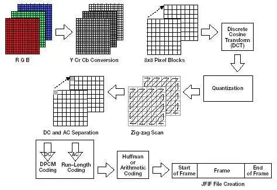

# JPEG_LZW_Compression
LZW and JPEG compression of grayscale and RGB Images

JPEG (Joint Photographic Experts Group) compression is a widely used method for reducing the size of digital images while preserving acceptable visual quality. It works by dividing the image into small blocks, transforming them into the frequency domain using the Discrete Cosine Transform (DCT), quantizing the resulting coefficients, and then applying entropy coding like Huffman coding. This process discards some image data, leading to lossy compression. The degree of compression can be adjusted by varying the quantization levels. JPEG compression is effective for photographs and images with smooth color gradients, making it a standard format for web and digital photography.

  

Sample baseline JPEG encode data flow. <a href="https://www.eetimes.com/baseline-jpeg-compression-juggles-image-quality-and-size/">[Source]</a>

LZW (Lempel-Ziv-Welch) compression, a renowned lossless data compression algorithm, efficiently reduces the size of both text and binary files. It operates by substituting repetitive character sequences with shorter codes from an initial dictionary containing individual characters. As it processes input data, the algorithm dynamically expands its dictionary, accommodating newly encountered sequences. When a sequence is matched in the dictionary, it is replaced with its corresponding code, achieving compression without data loss. LZW compression finds extensive application in file formats such as GIF and TIFF, as well as in data compression tools like ZIP, delivering effective compression for various data types while preserving data integrity.

